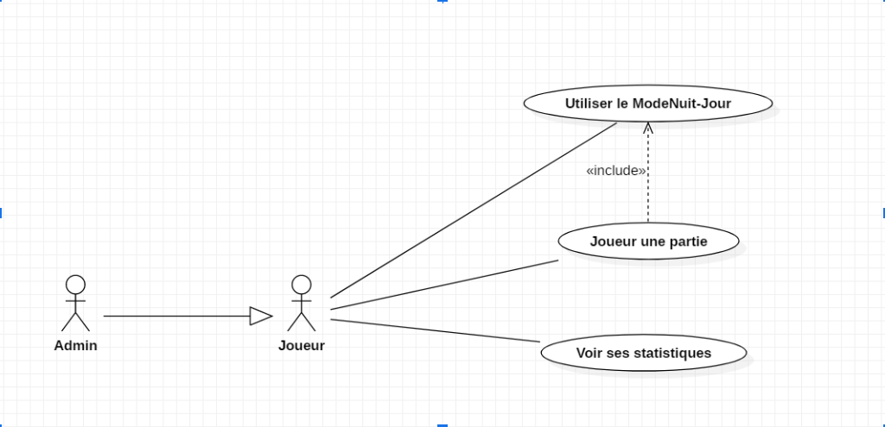

# PROJET TUTORE SWISH

## Objectif général du projet :

Codage d’un jeu (hébergé sur un site internet) basé sur le jeu Swish. Les règles
doivent être les mêmes au minimum et peut intégrer des fonctionnalités supplémentaires.
En suivant la méthode de travail “agile”, on doit pouvoir fournir une version minimaliste
fonctionnelle du projet avant l'implémentation de fonctionnalité.
> source ‘agile’ : ​ ​ https://fr.wikipedia.org/wiki/M%C3%A9thode_agile

## Version minimal et options :

Swish : Jeu de 60 cartes composé chacun de billes et de cerceaux, de 4 couleurs
différentes possibles. 16 cartes sont posés sur une table et le joueur doit faire superposer
des cartes de manière que chaque bille soit dans le cerceau de même couleur d’une autre
carte.
Fonctionnalités supplémentaire : Un mode multijoueur, mode de jeux : no time-limit
et course contre la montre, mode jour et nuit, mode daltonien, mode difficile, voir ses
statistiques (best score)
> source ‘swish’ : ​ ​ https://reglesdejeux.github.io/regles-du-jeu-swish/index.html

## Organisation de travail :

### INDIVIDUS RÔLES
```
LAFOURCADE Pascal Encadrant et référent
TOFFIN Cyril Participant au projet
SOUCHON Théo Participant au projet
PERALDE François Participant au projet
SEVRET Yannis Participant au projet
GOLFIER Alexandre Participant au projet
```

### TÂCHES

|François|Cyril|Théo|Yannis|Alexandre|
|--------|-----|----|------|---------|
|Mode jour| | Cahier des charges|fonction matrice comparaison cartes | Test multijoueur|
|Mode daltonien | | | | |

## Diagramme d’utilisation :



## Description du diagramme d’utilisation :

### Cas n°1 : Utiliser le ModeNuit-Jour :

```
● Acteur : Joueur / Admin
● Condition d’utilisation : L’utilisateur doit être sur le site
● Description : Fonctionnalité permettant de d’inverser la clarté des couleurs du site,
entre clair et sombre.
● Scénario de succès :
○ L’utilisateur arrive sur le site
○ L’utilisateur clique sur le bouton “ModeNuit-Jour”
○ La clarté des couleurs est inversé
```

### Cas n°2 : Joueur une partie :

```
● Acteur : Joueur / Admin
● Condition d’utilisation : L’utilisateur doit être sur le site
● Description : Fonctionnalité permettant de lancer une partie de swish.
● Scénario de succès :
○ L’utilisateur arrive sur le site
○ L’utilisateur clique sur le bouton “Lancer une partie”
○ La partie est lancé
```
### Cas n°3 : Voir ses statistiques :

```
● Acteur : Joueur / Admin
● Condition d’utilisation : L’utilisateur doit être sur le site et avoir joué une partie
● Description : Fonctionnalité permettant de voir ses statistiques sur ses parties de
swish.
● Scénario de succès :
○ L’utilisateur arrive sur le site
○ L’utilisateur clique sur le bouton “Statistique”
○ Les statistiques sont affiché
● Scénario d'échec :
○ L’utilisateur arrive sur le site
○ L’utilisateur clique sur le bouton “Statistique”
○ Un message d’erreur est affiché
```
### Cas n°4 : Voir les règles du jeu :

```
● Acteur : Joueur / Admin
● Condition d’utilisation : L’utilisateur doit être sur l'accueil du site
● Description : Fonctionnalité permettant de voir les règles du jeu swish.
● Scénario de succès :
○ L’utilisateur arrive sur le site
○ L’utilisateur clique sur le bouton “Règles”
○ Les règles sont affichées
```

## Problèmes rencontrés :

Pour voir ses statistiques, faut-il un compte? Est-ce local? Faut un nom d’utilisateur
?