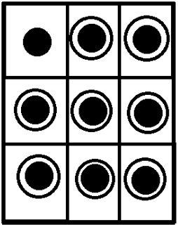
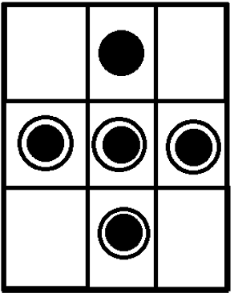
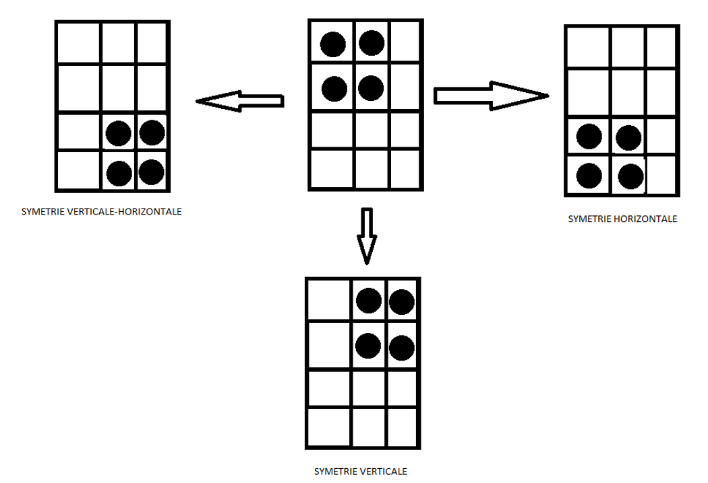
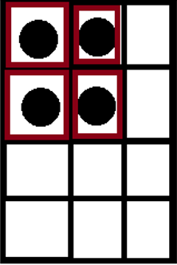
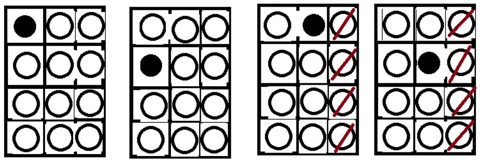

## Etude de jeux 3x3 (Et 2 figures présentes par cartes) :
On garde 60 cartes pour un paquet et 1 combinaisons toute les 15 cartes minimum.

Pourquoi 15 ? Car ¼ * 60
Donc 1 carte -> 3 cartes assemblables
Soit 15x1 cartes -> 15*3 cartes assemblables
On cherche 15 cartes uniques avec du 3x3 (Cartes uniques : attention symétrie)

Possibilité du rond (9)
Possibilité du cercle (8)
Soit 72(9*8) combinaisons totales

Mais on retire les doublons car cartes uniques :

Possibilité du rond (5)
Possibilité du cercle (4)
Soit 20(5*4) combinaisons totales donc on en retire la moitié afin d’enlever les doublons.
Donc 10 cartes doublées.
NB : Doublons (Matrice carré) : Si 2 figures sur un axe central.

On prend alors 15 de ces cartes uniques et on cherche 3 combinaisons pour chaque.

## Etude de jeux 4x3 :

Pb : comment sont choisies les cartes dans un paquet ?

Les cartes présentes dans le paquet 4x3 :

Nbforme : (carré,rond,ect …)
Nbfigure : (nommbre d’éléments sur une carte) | ex classique : 1 cercle et 1 rond sont présents par carte
n : nb de type d’éléments (ex avec 3 : Un grand cercle, un cercle moyen, un rond)

**36 x (nbfrome^nfigure)xsomme :k=1 :n-1(k)**

Soit (jeu classique : nbforme = rond, nfigure=2, n=2) : 36*1^2*2=72 cartes uniques
Pourquoi :

  ***36 : nombre de cartes uniques*** :

Cartes uniques : cartes qui peut importe la symétrie n’a pas d’équivalent dans le paquet

On se rend compte pour qu’il n’y a qu’une configuration pour les ronds qui n’importe pas la symétrie :

Maintenant les positions possibles des cercles pour les 4 ronds possibles :

Chaque rond représente une possibilité, soit 36 possibilités en excluant la symétrie causée par la matrice 4x3, soit l’axe verticale.

**NbForme et NbFigure :**

Cas référence : NbForme(1) (Rond), NbFigure (1)

R -> 8 cartes uniques

___importance NbForme : NbForme (varie) NbFigure(fixe)___

NbForme(2) = Rond, Carré

NbFigure (1)

R -> 8 | C -> 8 donc 16 cartes uniques

NbForme (3) = Rond, Carré, Triangle

NbFigure (1)

R -> 8 | C -> 8 | T -> 8 donc 24 cartes uniques

En conclusion,  nb cartes uniques : 36 x NbForme

___importance NbForme : NbForme (fixe) NbFigure(varie)___

NbForme(2)

NbFigure(2)

RC -> 36 | CR -> 36 | RR -> 36 | CC -> 36 donc 144 cartes uniques = 16 x 4

NbForme(2)

NbFigure(3)

CRC -> 144
