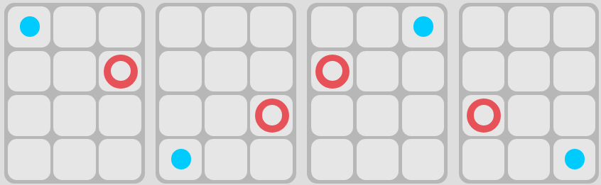

#COMMENT GENERER DES CARTES SWISH 3*4#

##Sommaire##
 - Introduction
 - Les Cartes Possibles
 - Les Types de Cartes
 - Génération des doublons
 - Conclusion

##Introduction ##

On peut croire qu'il existe un très grand nombre de possibilités de cartes à cause du nombre d'emplacements de Figures possible. 3*4 soit 12 au total.

Cependant, le jeu physique de swish utilise des cartes transparentes autirisant la rotation de celles-ci. Dès lors, plusieurs **variantes** d'une même carte sont possibles en retournant la carte de départ comme ici :

Le but de cette étude est donc de savoir qu'elles sont les cartes possibles en prenant en compte toutes les variantes et comment générer le  jeu physique Swish.

## Les Cartes Possibles ##

Pour éviter d'énumérer toutes les cartes au risque d'avoir des doublons. Nous devons comprendre le comportement des rotations en s'aidant d'un repère.

Dans notre cas, on sait que chaque carte possède 2 Figures : 

 - Une petite : un point
 - Une Grande : un cercle

Pour cette étude nous allons choisir le point de chaque carte comme repère.

Un point sur une carte peut avoir plusieurs positions. Il faut donc déterminer quelles sont les positions jumelées, c'est-à-dire, les positions qu'un point peut avoir en faisant des rotations.  

Nous allons nous aider du code couleur présent sur les cartes.

### Point Bleu et Rouge ###
Ces points possèdent 4 positions jumelées chacun. Comme ici :
 

### Point Vert et Violet###
Ces points possèdent 2 positions jumelées chacun. La différence entre ces points et les autres réside dans le fait qu'il existe une symétrie axiale causée par le nombre impair de colonne sur les cartes.

----

Maintenant que nous savons les positions de point possible. Pour chaque couleur de point, (Rouge,Bleu,Vert,Violet), nous allons garder qu'une seule position  d'un point (haut-droit) puis énumerer toutes les positions qu'un cercle peut prendre sur une carte afin de créer un ensemble de carte Swish.

### Point Bleu et Rouge ###
Sur une carte il existe 12 positions différentes causées par le quadrillage 3*4 d'une carte. Si l'une des positions est déjà prise par un point (Bleu ou Rouge) le cercle peut alors avoir 11 positions possibles comme ici :

Pour ces points il existe donc 11 possibilitées de carte chacun soit 22 cartes.

### Point Vert et Violet ###
Pour ces points il existe une symétrie axiale déjà énumérée au-dessus à cause du nombre impair de colonne sur une carte. Lorsqu'un point se situe sur la colonne centrale, une symétrie se crée entre les deux autres colonnes. Ainsi les cercles ne possèdent pas 11 positions possibles mais plus que 7 comme ici:

Pour ces points il existe donc 7 possibilitées de carte chacun soit 14 cartes.

**Au total nous trouvons 36 cartes possibles en prenant en compte les rotations**

----

##Les Types De Carte##

Après avoir énuméré toutes les cartes possibles. Nous pouvons analyser les cartes crées et repérer des propriétés.

En effet nous pouvons déjà séparer toutes les cartes en deux familles : 
### Cartes unies###

Cette famille contient uniquement les cartes possèdant un point et un cercle de même couleur.

La propriété principale d'une carte unie est que sa **complémentaire** (carte avec laquelle elle forme un assemblage de 2 cartes) est elle-même. Cette propriété va nous aider pour la génération des cartes plus tard.

### Cartes bicolores###

Cette famille contient toutes les autres cartes possibles exceptées les cartes unies. C'est-à-dire les cartes composées d'un point et d'un cercle de couleurs différentes. 

À la différence des cartes unies, la complémentaire d'une carte bicolore n'est pas elle-même. Mais une carte différente composée d'un cercle et d'un point de couleur et position opposée afin de former un assemblage correct. Comme-ici :

Nous savons qu'il existe 36 possibilités de cartes. 8 d'entre elles sont des cartes unies. Il reste donc 28 cartes bicolores que l'on peut rassembler en 14 paires de cartes complémentaires. 

Ces 14 paires peuvent être elles aussi regrouper en fonction de leurs duos de couleurs formés par leurs figures. 

Par exemple voici les familles des duos (Vert-Bleu) et (Violet-Rouge) composées de 2 paires de cartes complémentaires chacune:

**Remarque: Le fait de regrouper les cartes bicolores en famille de plus en plus précise va nous aider à comprendre le principe de génération des cartes.**

##Génération des doublons##

Un jeu de cartes Swish contient 60 cartes. Sachant qu'il n'existe que 36 possibilités de cartes. Nous savons donc que le jeu possède des doublons.

Cependant, si nous doublons toutes les cartes 36*2, nous obtenons un tas de 72 cartes. Il y a donc 12 cartes en trop. 12 cartes qui n'ont pas de doublons dans le paquet mais lesquels ? 

En réalité, les 12 cartes manquantes sont en lien avec les paires complémentaires des familles de duos de couleurs vues au-dessus.

En effet, il existe un total de 6 familles de duos de couleurs :

###Bleu-Rouge###

###Bleu-Vert###

###Bleu-Violet###

###Rouge-Vert###

###Rouge-Violet###

###Violet-Vert###

À cause de la symétrie axiale causée par le nombre impair de colonne sur les cartes, les familles de duos possèdent un nombre de cartes et donc de paires différents.

Pour générer les 60 cartes, nous devons doubler toutes les cartes unies de façon à pouvoir former les paires complémentaires. Sachant qu'il y a 8 cartes unies nous obtenons 16 cartes pour le moment.

Pour les cartes bicolores il faut s'intéresser aux familles de duos de couleurs. Pour chaque famille il existe un nombre de paires de cartes complémentaires. La logique est très simple, nous allons doubler toutes les paires sauf une.  

**Par exemple** pour la famille (Bleu-Vert) nous avons 2 paires de cartes complémentaires :

**Mais une seule est doublée pour obtenir ces cartes dans le jeu physique**

**REMARQUE** : **Ce processus est utilisé pour toutes les familles de duos sauf les familles (Vert-Violet) et (Bleu-Rouge) qui sont des familles particulières.**

En effet pour la famille (Vert-Violet)
**Nous allons doubler toutes les paires.**
Tandis que pour la famille (Bleu-Rouge).
**Deux paires ne vont pas être doublées.** Nous avons finalement nos 60 cartes dans le paquet en évitant de doubler un total de 12 cartes.

##CONCLUSION##

En suivant le processus nous avons réussi à enlever 12 cartes du jeu et ainsi obtenir le tas de 60 cartes que le jeu physique utilise.

**Mais pourquoi enlever 12 cartes ?** 

Cela peut s'expliquer car les règles du jeu précisent que durant une partie, 16 cartes sont présentées aux joueurs. Dans des cas extrêmement rares, les 16 cartes ne peuvent être assemblées. Enlever ces 12 cartes, c'est tout simplement réduire les possibilités pour qu'un événement pareil se déroule dans une partie même si les possibilitées ne sont tout de même pas nul...
